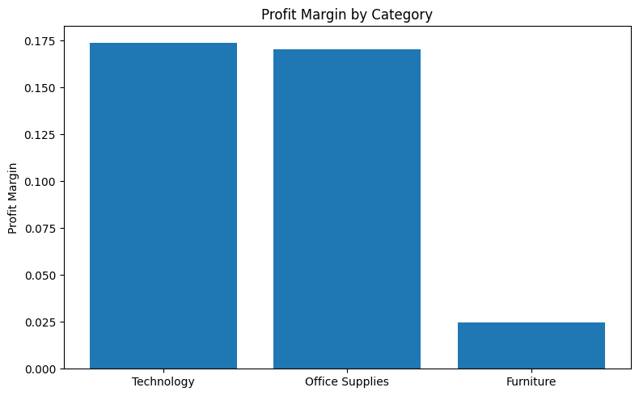
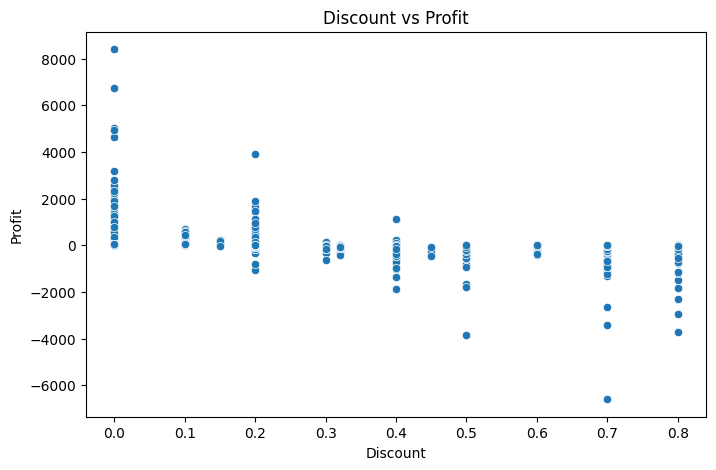
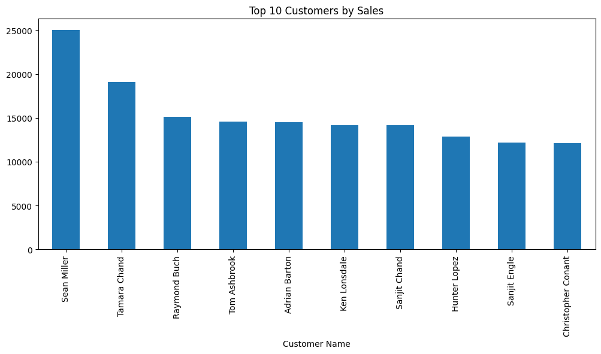

# Superstore Sales Performance Analysis

End-to-end data analysis project using **PostgreSQL, Python, and Power BI** to evaluate revenue growth, profitability trends, customer concentration, and the impact of discounting.

This project simulates a real-world junior data analyst workflow:

Raw Data → SQL Validation → Python Analysis → Business Insights → Dashboard Reporting

---

# Tools & Technologies

- PostgreSQL
    
- pgAdmin 4
    
- Python (Pandas, Matplotlib, Seaborn)
    
- Power BI
    

---

# SQL Analysis

SQL was used to validate the dataset and answer core business questions through aggregation and grouping.

## 1. What are total sales, total profit, and total quantity sold?

Validated overall business performance and confirmed data integrity after import.

---

## 2. Which Region Performs Best?

Identified the highest-performing geographic region based on total sales.

---

## 3. Which Category Makes the Most Money?

Determined which product category generates the highest total profit.

---

## 4. Are Discounts Hurting Profit?

Evaluated the relationship between discount levels and profitability.

---

## 5. Who Are the Top 10 Customers?

Identified the highest revenue-generating customers.

---

# Python Analysis & Visualization

Python was used for trend analysis, growth comparison, margin efficiency, and deeper exploratory insights.

---

## 6. Is the Business Growing Over Time?

Sales show a consistent upward trend across years. Profit generally follows revenue growth, though with higher volatility.

---

## 7. Is Profit Growing at the Same Rate as Sales?

Profit growth broadly aligns with sales growth, though certain periods show margin compression.

---

## 8. Which Categories Are Most Efficient?

Technology demonstrates the strongest profitability efficiency relative to revenue.

---

## 9. Does Discounting Hurt Profit?

Higher discount levels are associated with declining profit and increased likelihood of losses.

---

## 10. Is Revenue Concentrated Among Few Customers?

Revenue is partially concentrated among a small group of high-value customers.

---

# Power BI Dashboard

An interactive dashboard was developed in Power BI to present executive-level insights.

The dashboard includes:

- Total Sales, Profit, and Profit Margin KPIs
    
- Monthly Revenue & Profit Trends
    
- Sales by Region
    
- Profit by Category
    
- Discount Impact Analysis
    
- Top Customer Breakdown
    

[Insert Image – Power BI Dashboard Overview]

The dashboard enables interactive filtering by region, category, and time period.

---

# Key Insights

- Revenue demonstrates consistent growth over time.
    
- Profit growth follows revenue but is sensitive to discount levels.
    
- Technology is the most profitable category.
    
- Excessive discounting significantly impacts margin performance.
    
- Revenue concentration exists among top customers.
    

---

# Project Outcome

This project demonstrates:

- SQL data validation and aggregation
    
- Python-based analytical reasoning
    
- Visualization of business metrics
    
- Executive-level dashboard reporting