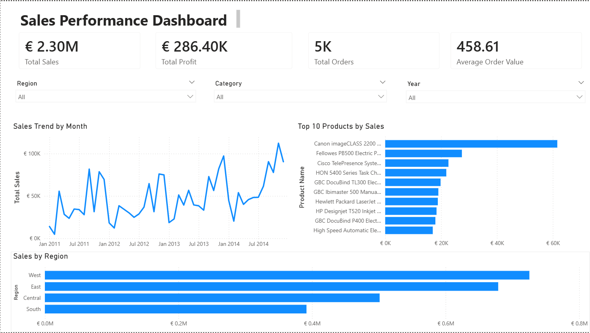
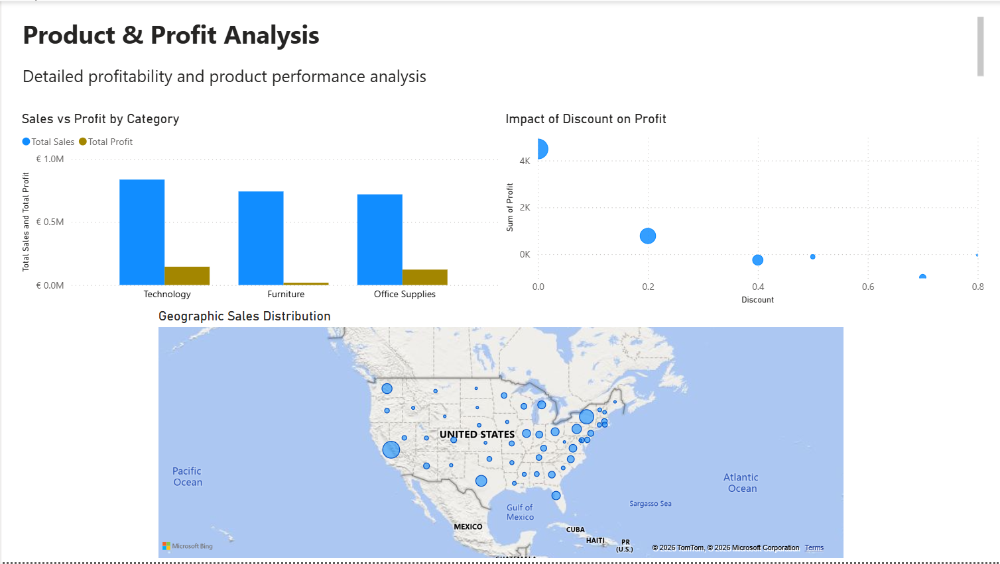

# Superstore Sales Performance Analysis

End-to-end business analysis project using **PostgreSQL, Python, and Power BI** to evaluate revenue growth, profitability trends, customer concentration, and the impact of discounting.

This project demonstrates a full analytical workflow:

Raw Data → SQL Validation → Python Analysis → Business Insights → Executive Dashboard

---

# Tools & Technologies

- PostgreSQL
    
- pgAdmin 4
    
- Python (Pandas, Matplotlib, Seaborn)
    
- Power BI
    

---

# Data Preparation

The raw CSV dataset was imported into PostgreSQL and cleaned before analysis.

Data preparation steps:

- Imported dataset into PostgreSQL
    
- Resolved encoding issues during import
    
- Converted date fields to proper DATE format
    
- Converted Sales, Profit, Discount, and Quantity to numeric types
    
- Validated totals after transformation
    
- Ensured correct data types inside Power BI
    

Proper data typing ensured accurate aggregations, calculations, and reporting consistency across SQL, Python, and Power BI.

---

# SQL Analysis

SQL was used to validate the dataset and answer core business questions through aggregation and grouping.

## 1. What are total sales, total profit, and total quantity sold?

This query validated overall business performance and confirmed data integrity after import.

---

## 2. Which Region Performs Best?

Identified the highest-performing geographic region based on total sales.

---

## 3. Which Category Makes the Most Money?

Determined which product category generates the highest total profit.

---

## 4. Are Discounts Hurting Profit?

Analyzed the relationship between discount levels and profitability.

---

## 5. Who Are the Top 10 Customers?

Identified the highest revenue-generating customers.

---

# Python Analysis & Visualization

Python was used for trend analysis, growth comparison, efficiency measurement, and exploratory data analysis.

---

## 6. Is the Business Growing Over Time?

Sales show a consistent upward trend over time. Profit follows revenue growth but displays higher volatility.

---

## 7. Is Profit Growing at the Same Rate as Sales?

Profit growth generally aligns with sales growth, though certain periods indicate margin compression.

---

## 8. Which Categories Are Most Efficient?

Technology demonstrates the strongest profitability relative to revenue, indicating higher operational efficiency.

---

## 9. Does Discounting Hurt Profit?

Higher discount levels correlate with reduced profit and increased probability of losses.

---

## 10. Is Revenue Concentrated Among Few Customers?

A small group of customers contributes a significant share of total revenue, indicating partial revenue concentration.

---

# Power BI Dashboard

The dataset was imported into Power BI to create an interactive executive dashboard.

Data types were validated and corrected inside the Power BI model.

Key DAX Measures created:

- Total Sales = SUM(Sales)
    
- Total Profit = SUM(Profit)
    
- Total Quantity = SUM(Quantity)
    
- Average Order Value = DIVIDE([Total Sales], DISTINCTCOUNT(Order ID))
    

---

## Sales Performance Dashboard

This dashboard includes:

- KPI cards (Total Sales, Total Profit, Orders, Average Order Value)
    
- Monthly sales trend
    
- Top 10 products by sales
    
- Sales by region
    
- Interactive slicers (Region, Category, Year)
    

---

## Product & Profit Analysis

This dashboard includes:

- Sales vs Profit by category
    
- Impact of discount on profitability
    
- Geographic sales distribution
    

---

# Key Insights

- Revenue demonstrates consistent year-over-year growth.
    
- Profit growth follows revenue but is sensitive to discount levels.
    
- Technology is the most profitable category.
    
- High discount levels significantly reduce margin performance.
    
- Revenue is partially concentrated among top customers.