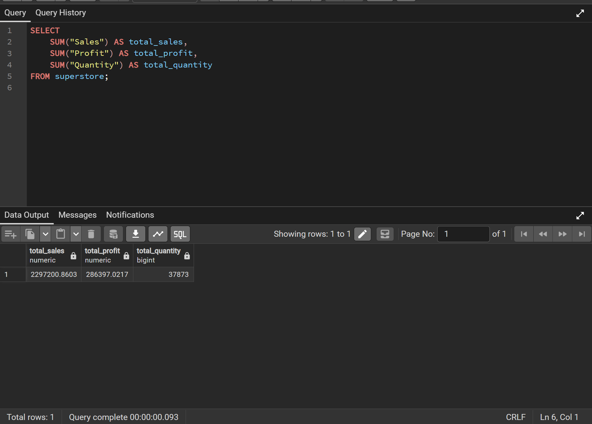
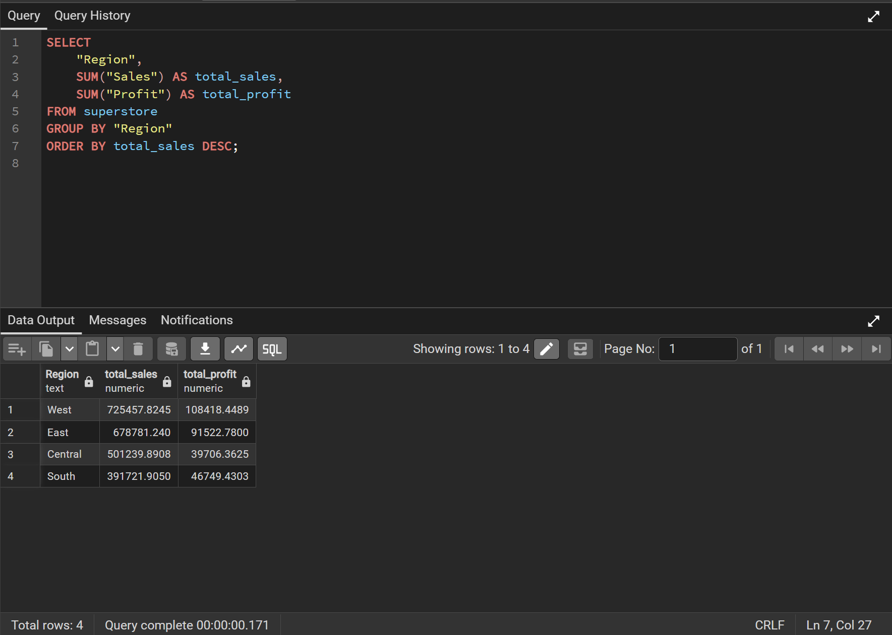
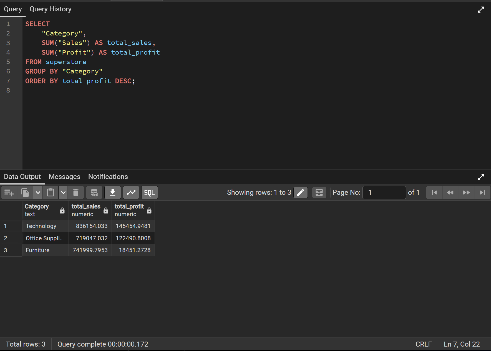
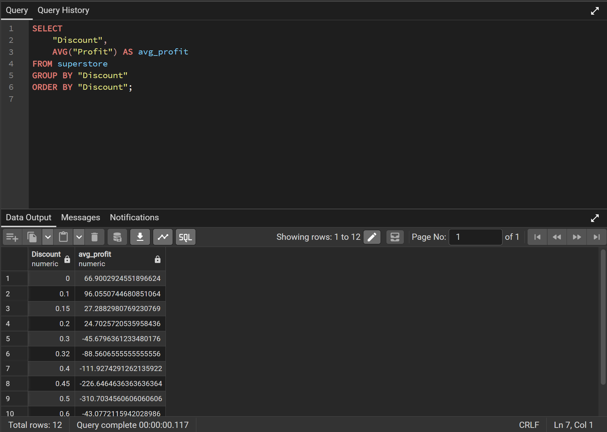
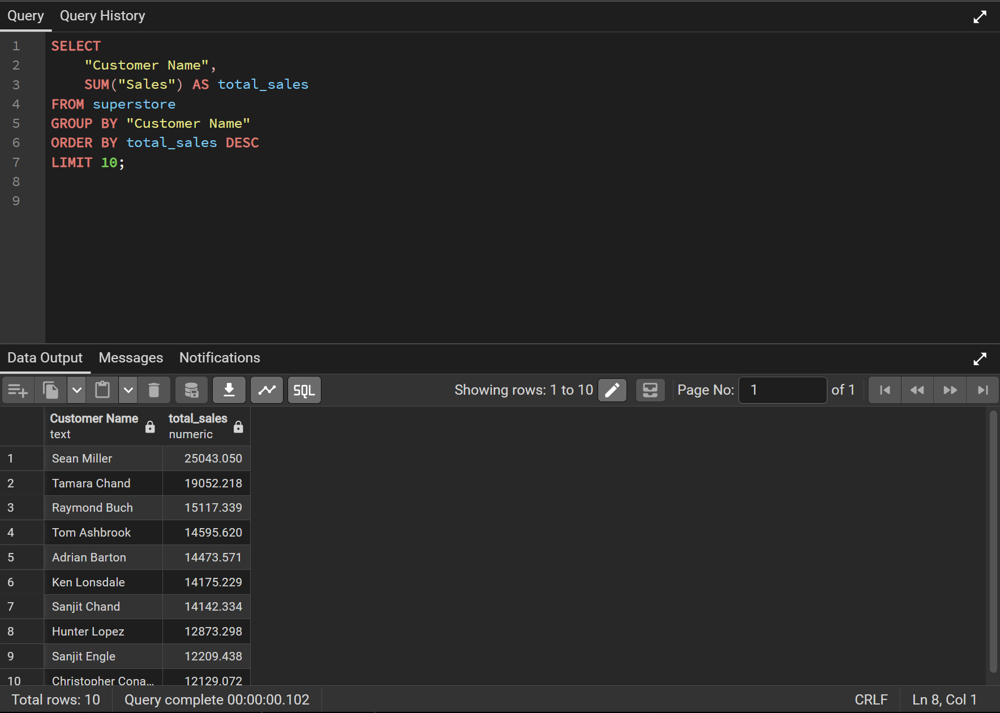
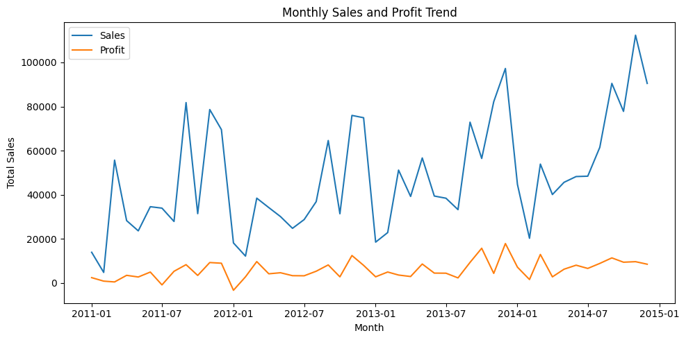

# SQL Analysis

SQL was used for data validation, aggregation, and answering core business questions.

## 1. What are total sales, total profit, and total quantity sold?

This query validates overall business performance and confirms data integrity after import.

---

## 2. Which Region Performs Best?

This analysis identifies the highest-performing geographic region based on total sales.

---

## 3. Which Category Makes the Most Money?

This query determines which product category generates the highest total profit.

---

## 4. Are Discounts Hurting Profit?

This analysis evaluates whether higher discount levels negatively impact profitability.

---

## 5. Who Are the Top 10 Customers?

This query identifies the highest revenue-generating customers.

---

# Python Analysis and Visualization

Python was used to explore trends over time and visualize deeper performance insights.

---

## 6. Is the Business Growing Over Time?

This visualization shows revenue and profit trends over time to assess overall growth.

---

## 7. Is Profit Growing at the Same Rate as Sales?

This analysis evaluates whether profit growth aligns proportionally with revenue growth.

---

## 8. Which Categories Are Most Efficient?

[Insert Image – Profit by Category Chart]

This visualization compares profitability across product categories.

---

## 9. Does Discounting Hurt Profit?

[Insert Image – Discount vs Profit Scatter Plot]

This chart illustrates the relationship between discount levels and profitability.

---

## 10. Is Revenue Concentrated Among Few Customers?

[Insert Image – Top 10 Customers Chart]

This analysis examines whether a small number of customers contribute a large share of total revenue.